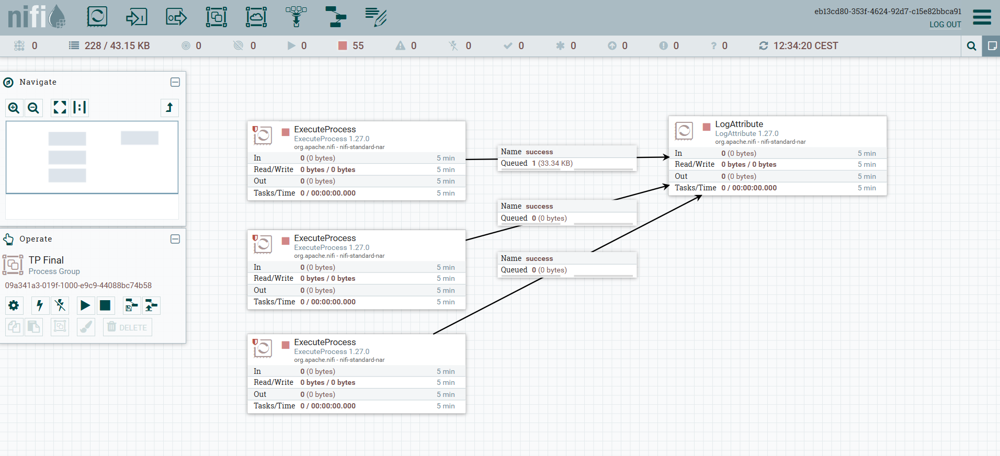

# Plateforme d'Analyse des Marchés Boursiers et des Événements

**Projet de fin de module ETL — M2 IA, Ynov (2025-2026)**
Auteur : Jean Roelens


## 1. Architecture générale

```
yfinance (10 symboles) ─┐
                        ├─► [producer.py] ─► Kafka ─► [Spark Streaming] ─► MySQL (cours, mesures)
RSS (5 flux) ───────────┘        (3 topics)              [Spark batch]         │
                                                                               ▼
                                              [LLM Qwen2.5-1.5B] ◄── MongoDB (actualités + métadonnées)
                                                                               │
                                                                  [Dashboard Streamlit]
```

### Choix techniques

| Composant | Choix | 
|-----------|-------|
| Execution / Orchestration script python| **NiFi** | |
| Bus de messages | **Kafka** (KRaft, mono-nœud, Docker) | 
| Traitement | **Spark** Structured Streaming + batch (local, pyspark) | 
| Relationnel | **MySQL 8.4** (Docker) |
| NoSQL | **MongoDB 7** (Docker) |
| LLM | **Qwen2.5-1.5B-Instruct** (`transformers`, local, CPU) |
| Interface | **Streamlit + Plotly** |
| Orchestration | conteneurs **Docker Compose** + environnement **conda** |

---

## 2. Étape 1 — Collecte et ingestion

**Sources de données :**
- **Cours de bourse** via `yfinance` : 5 actions (AAPL, MSFT, NVDA, GOOGL, TSLA),
  2 cryptos (BTC, ETH), 3 indices (S&P 500, CAC 40, DAX).
- **Actualités** via 5 flux **RSS** (Les Échos, WSJ, CNBC, Le Monde, Google News),
  routés selon leur nature vers deux topics distincts.

Le script `producer.py` met en forme chaque enregistrement (schéma JSON stable) et le publie
dans le bon **topic Kafka** :
- `topic_cours_bourse` — prix des actifs ;
- `topic_actualites_finance` — actualités financières ;
- `topic_evenements_mondiaux` — événements économiques / politiques.

**Orchestration NiFi** : **Apache NiFi** orchestre toute la boucle temps réel. Trois flows
`ExecuteProcess` (planifiés toutes les 60 s), chacun suivi d'un `LogAttribute`, lancent
`producer.py` (→ Kafka), `stream_to_mysql.py` (Kafka → MySQL) et `consumer_mongo.py`
(Kafka → MongoDB). Les traitements lourds (mesures, enrichissement LLM) restent déclenchés à la demande dans le cadre du PoC.



---

## 3. Étape 2 — Streaming, transformation et mesures

### 3.1 Modélisation des données (schéma en étoile)

Côté relationnel, séparation **faits / dimension** :
- **`actif`** (dimension) : descriptif de chaque symbole (nom, type, secteur, pays, devise),
  alimenté depuis `yfinance.info`.
- **`cours_bourse`** (faits) : observations de prix intraday (temps réel), reliées à `actif`
  par une clé étrangère.
- **`cours_journalier`** : historique quotidien (~3 mois) pour le calcul des mesures.
- **`mesures`** : indicateurs calculés par symbole et par jour.

### 3.2 Traitement Spark

- **`stream_to_mysql.py`** — Spark **Structured Streaming** lit `topic_cours_bourse`,
  structure le JSON et écrit chaque micro-batch dans MySQL (sink idempotent).
- **`compute_measures.py`** — Spark **batch** calcule les indicateurs via des
  *Window functions* (`partitionBy(symbol).orderBy(date)` + fenêtres glissantes) :
  - **volatilité** : écart-type des rendements logarithmiques sur 30 jours ;
  - **tendance** : moyennes mobiles SMA 20 / 50 et label haussière/baissière ;
  - **volume moyen** sur 20 jours.

Résultat cohérent et interprétable : la volatilité décroît des **cryptos/actions
individuelles** vers les **indices diversifiés** — un résultat financier réel qui valide
le calcul.

### 3.3 Enrichissement par LLM

Pour chaque actualité, le modèle **Qwen2.5-1.5B-Instruct** (exécuté en local sur CPU)
génère des **métadonnées JSON** : type d'événement, impact attendu, actifs concernés,
localisation, résumé. Ces métadonnées sont ajoutées aux documents MongoDB (sans migration
de schéma — intérêt du NoSQL).

**Association événement ↔ actif (approche hybride)** : le LLM extrait des entités souvent
approximatives ; un **matching déterministe** (mots-clés issus de la table `actif` + alias
manuels) les rattache ensuite aux symboles réels de l'univers suivi.

---

## 4. Étape 3 — Restitution (dashboard)

Un **dashboard Streamlit** (3 onglets) restitue toute la chaîne :
1. **Vue marché** — derniers cours par actif (temps réel) ;
2. **Détail actif** — prix sur 3 mois + SMA 20/50 + volatilité + volume (Plotly) ;
3. **Actualités enrichies** — fil d'actus avec métadonnées LLM et symboles associés,
   filtrable par type d'événement et impact.

---

## 5. Sécurité et qualité du code

- **Aucun secret en dur** : identifiants centralisés dans `config.py`, chargés depuis un
  fichier `.env` (non versionné) ; `.env.example` documente les clés.
- **Idempotence** systématique des écritures (re-jouabilité du pipeline).
- **Configuration Spark Windows** isolée dans `spark_env.py`.

---

## 6. Limites et perspectives

- **Qualité du LLM** : le modèle 1.5B sur CPU reste limité sur le raisonnement fin
  (classification du type d'événement encore imparfaite). Pistes : modèle plus grand,
  GPU, ou affinage. C'est un compromis assumé compte tenu des contraintes matérielles.
- **Moteur NL → SQL (bonus)** : transformer des questions en langage naturel en requêtes
  SQL/NoSQL via le LLM, en lui fournissant le schéma des bases.
- **Conteneurisation complète** : NiFi et Spark tournent aujourd'hui sur l'hôte ; les
  intégrer au `docker-compose` permettrait un déploiement en une commande.
- **Vrai temps réel** : passer le streaming Spark en micro-batch permanent (plutôt qu'à
  la demande), en complément de l'ingestion NiFi déjà continue.
- **Point critique Kafka** : Kafka représente un point critique de l'infrastructure, si kafka vient à tomber c'est l'intégralité 
  du pipeline qui échoue 
- **Script -> vrai proccess NiFi** : Aujourd'hui l'architecture s'articule autour de trois script `[producer.py](./ingestion/producer.py)` `[consumer_mongo.py](./ingestion/consumer_mongo.py)` `[stream_to_mysql.py](./streaming/stream_to_mysql.py)` qui sont lancé par NiFi, c'est de la perte de puissance de calcul l'idéal serait que NiFi soit réellement l'acteur principal qui, via ses processus, éxécute les étapes nécessaires aux pipelines aujourd'hui fait par nos scripts. Mais cela pourrait aussi représenter un risque d'architecture rendant NiFi un point critique de l'architecture.

